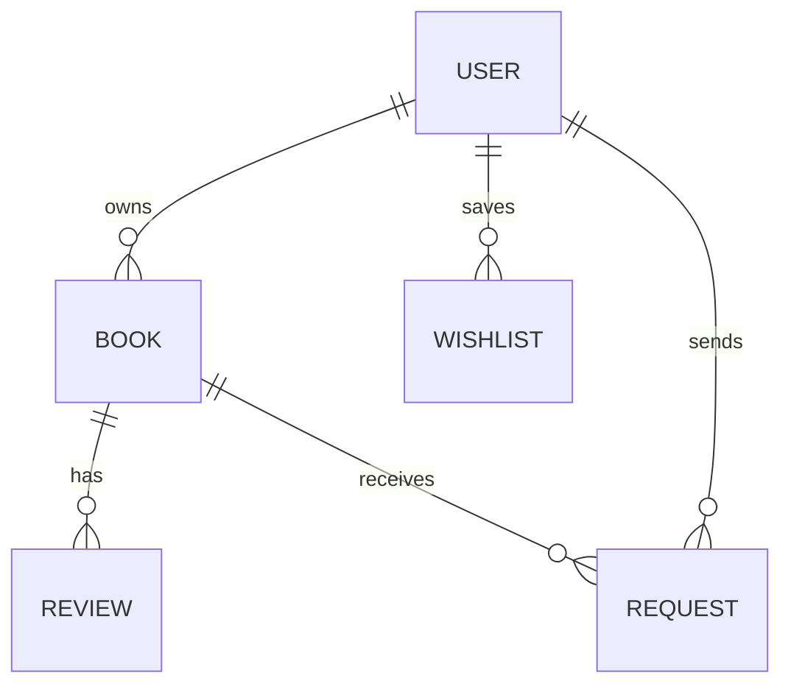

# 📚 BookCycle - Book Exchange & Selling Platform

A full-stack web application designed to **recycle knowledge by allowing readers to share, borrow, exchange, and sell books within their community**.

> 📖 *Recycle knowledge by passing books from one reader to another.*


---

# 🌍 Project Vision

BookCycle promotes **knowledge recycling**.

Instead of books staying unused after one reader finishes them, the platform allows books to **circulate between readers**, making learning more affordable and accessible.

Benefits:

- Reduce cost of educational books
- Encourage reading culture
- Promote sustainable knowledge sharing
- Build local reading communities

---

# ✨ Features

## 📖 For Readers

- Browse books by **category, city, and author**
- Borrow books for free
- Exchange books with other users
- Buy books at affordable prices
- Add books to **wishlist**
- Leave **reviews and ratings**

---

## 📚 For Book Owners

- Add books with **title, author, cover image, description**
- Set **listing type** (Borrow / Exchange / Sell)
- Manage book listings
- Accept or reject requests
- Track requests and exchanges

---

# ⚙️ Platform Features

✔ Secure authentication using **JWT**  
✔ Book search and filtering  
✔ City-based book discovery  
✔ Wishlist system  
✔ Admin dashboard  
✔ Responsive UI design  

---

# 🏗️ System Architecture

```mermaid
flowchart LR

User[User Browser]
Frontend[React Frontend]
Backend[Spring Boot API]
Database[(MySQL Database)]

User --> Frontend
Frontend --> Backend
Backend --> Database
Database --> Backend
Backend --> Frontend
Frontend --> User
````

---

# 🧰 Tech Stack

## Frontend

* React 18
* Vite
* React Router
* Context API
* CSS Modules

## Backend

* Spring Boot 3
* Spring Security
* JWT Authentication
* Spring Data JPA
* Maven

## Database

* MySQL
* H2 (for development)

---

# 📁 Project Structure

```
bookshare-platform
│
├── bookshare-backend
│   └── src/main/java/com/bookshare_backend
│       ├── controller
│       ├── service
│       ├── repository
│       ├── entity
│       ├── dto
│       ├── security
│       └── exception
│
├── bookshare-frontend
│   └── src
│       ├── components
│       ├── pages
│       ├── services
│       └── App.jsx
│
└── README.md
```

---

# 🔌 API Endpoints

## Authentication

```
POST /api/auth/register
POST /api/auth/login
```

## Books

```
GET    /api/books
GET    /api/books/{id}
POST   /api/books
PUT    /api/books/{id}
DELETE /api/books/{id}
```

## Users

```
GET /api/users/me
PUT /api/users/me
```

## Wishlist

```
GET    /api/wishlist
POST   /api/wishlist/{bookId}
DELETE /api/wishlist/{bookId}
```

## Requests

```
GET  /api/requests/sent
GET  /api/requests/received
POST /api/requests/{id}/accept
POST /api/requests/{id}/reject
```

---

# 🖼️ Screenshots

## Home Page


## Book Listing


## Book Details


---

# 🚀 Getting Started

## Prerequisites

Make sure you have installed:

* Node.js 18+
* Java 17+
* Maven
* MySQL (optional)

---

# 🔧 Backend Setup

```bash
cd bookshare-backend

./mvnw clean install

./mvnw spring-boot:run
```

Backend will start at:

```
http://localhost:8080
```

---

# 💻 Frontend Setup

```bash
cd bookshare-frontend

npm install

npm run dev
```

Frontend will start at:

```
http://localhost:5173
```

---

# 📊 Database Concept



---

# 🔮 Future Improvements

Possible enhancements:

* AI book recommendation system
* Chat between users
* Book delivery integration
* Mobile application
* Advanced search filters

---

# 🤝 Contributing

1. Fork the repository

2. Create feature branch

```
git checkout -b feature/new-feature
```

3. Commit changes

```
git commit -m "Add new feature"
```

4. Push to GitHub

```
git push origin feature/new-feature
```

5. Open Pull Request

---

# 📜 License

This project is licensed under the **MIT License**.

---

# Acknowledgment

Made with passion for **book lovers and lifelong learners**.

Because **knowledge should travel from one reader to another.**


